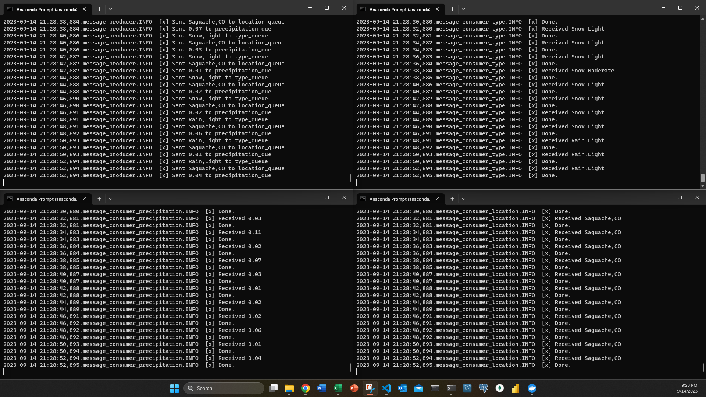

# Streaming-04-bonus-jordanwheeler

- Jordan Wheeler
- CSIS 44671: Streaming Data
- Module 4 Bonus Assignment
- 14 September 2023
- [GitHub Repo](https://github.com/jordanwheeler7/streaming-04-bonus-jordanwheeler)
- [Repository Page]()

## Overview

This project is a bonus assignment that serves to provide more practice with streaming data. To do this, we created 1 producer and 3 consumers. The message that the producer sends is from the data_weather.csv file. It then sends a different message to each of the 3 workers who write to their respective csv file. In the data_location file, we take the output and convert the location to all upper case letters. We do teh same for the data_type except this file tells us what weather event took place and the severity. The final csv file is data_precipitation which takes the precipitation amount in inches and converts it to centimeters, rounded to 2 places.

## Dataset
[Kaggle](https://www.kaggle.com/datasets/sobhanmoosavi/us-weather-events) is where we found this dataset. We did a lot of cleanning to provide only the 5 rows that we wanted to explore in this project.

## Requirements
1. Git
1. Python 3.7+ (3.11+ preferred)
1. VS Code Editor
1. VS Code Extension: Python (by Microsoft)
1. RabbitMQ Server installed and running locally

## Create a Virtual Environment
1. Open a terminal window
1. Navigate to the project folder
1. Type `python -m venv .venv` to create a virtual environment
1. Type `source .venv/bin/activate` to activate the virtual environment

## Run the Files
1. Open 4 terminal windows
2. Activate the virtual environment in each window
3. In the first window, type `python message_producer.py` to run the producer
4. In the second window, type `python message_consumer_type.py` to run the first worker
5. In the third window, type `python message_consumer_location.py` to run the second worker
6. In the fourth window, type `python message_consumer_precipitation.py` to run the third worker
7. This will allow the process to continue to run until you stop it with `ctrl + c` in the producer window. You will also need to stop the workers in the other windows as well utilizing the same command.
8. You can then view the csv files that were created in the project folder.

## What it looks like

